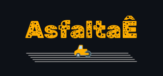

<h1 align="center">
  
</h1>

  <a href="#-tecnologias">Tecnologias</a>&nbsp;&nbsp;&nbsp;|&nbsp;&nbsp;&nbsp;
  <a href="#-projeto">Projeto</a>&nbsp;&nbsp;&nbsp;|&nbsp;&nbsp;&nbsp;
  <a href="#-layout">Layout</a>&nbsp;&nbsp;&nbsp;|&nbsp;&nbsp;&nbsp;
  <a href="#-como-executar">Como executar</a>&nbsp;&nbsp;&nbsp;|&nbsp;&nbsp;&nbsp;
  <a href="#-licença">Licença</a>

  

 

 

  

## ✨ Tecnologias

Esse projeto foi desenvolvido com as seguintes tecnologias:

- [React Native](https://reactnative.dev/)
- [Expo](https://expo.dev/)
- [NodeJS](https://nodejs.org/)
- [TypeScript](https://www.typescriptlang.org/)
- [TypeORM](https://typeorm.io/)

## 💻 Projeto

O Points App é um app que registra ruas esburacadas nas vias urbanas de forma simples e objetiva.

## 🔖 Layout

Você pode visualizar o layout do projeto através [desse link](https://www.figma.com/). É necessário ter conta no [Figma](http://figma.com/) para acessá-lo.

## 🚀 Como executar

- Clone o repositório: `git clone git@github.com:carlozfilipe/asfaltae-mobile.git`
- Instale as dependências com `yarn` no diretório **backend**.
- Instale as dependências com `npm i` no diretório **mobile**.
- Inicie o servidor backend com `yarn dev`
- Inicie o servidor mobile com `npx expo start`

Agora você pode acessar utilizando o [Expo](https://expo.dev/) no seu dispositivo real ou emulador.

## 📄 Licença

Esse projeto está sob a licença MIT. Veja o arquivo [LICENSE](LICENSE.md) para mais detalhes.

---

Feito com ♥ by [Carlos Filipe](https://x.com/carlozfilipe) 👋🏻
